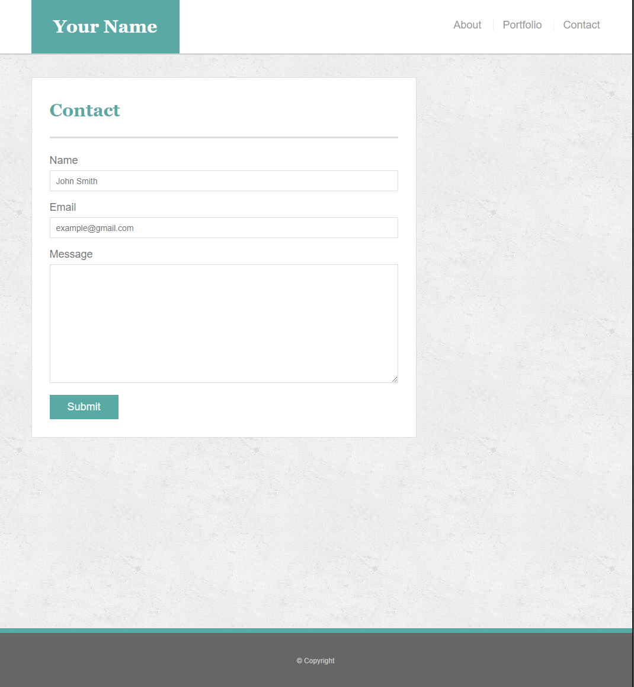

# Responsive portfolio

## Overview

This is a responsive portfolio built using BootStrap v4.5, HTML5, and CSS3. The purpose of this portfolio is to develop a webpage that responds to different media breakpoints with pixel resolution of  `max-width: 640px, 768px, 980px `, there should be three different media responses with the corresponding `max-width`. 

## Objective
To mimic an existing webpage and include media breakpoints to improve User Interface and functionality for different screen resolutions. The web to recreate is shown: 

640px
***

768px
***

980px
***

## Preview
Visit the live live webpage [here](https://eddyangang.github.io/responsive_portfolio/).

